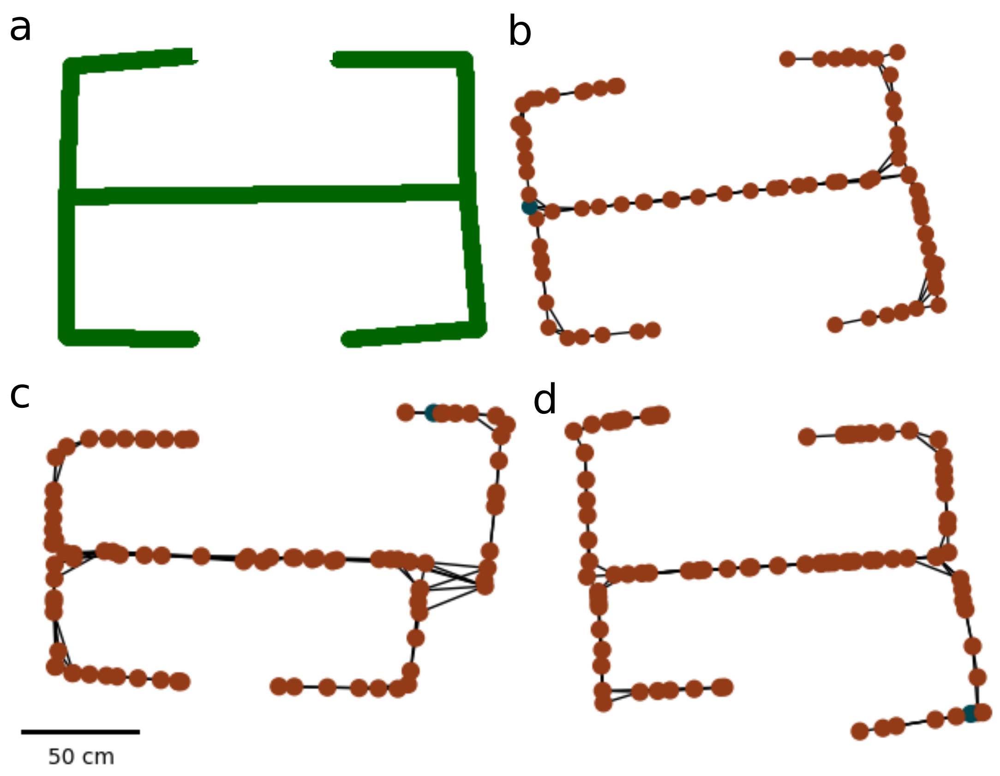

## *MindMap*

---

This repo contains functionality to train deep neural decoders for any behavioural variable which can be expressed as 
a time series. The architecture for the networks is inspired by those described by 
[Frey et. al (2021)](https://elifesciences.org/articles/66551). We use a pyTorch implementation for added network 
versatility. 

This repo also contains functionality for using these decoders to perform BrainSLAM - 
a SLAM algorithm designed to operate using neural
LFP data (as opposed to camera or lidar input, as traditional SLAM algorithms would).


This repo was used in both https://arxiv.org/abs/2402.00588 and https://www.biorxiv.org/content/10.1101/2024.02.01.578423v1.abstract

Though one could use this repo to decode any variable, it has been built with spatial variables in mind
(namely position, direction, and speed).

---

### Setup

Install torch and the given requirements. 

To train networks, you need at least one HDF5 file in the data/ directory.

This file hierarchy should look like:
```
-- inputs
---- wavelets
---- fourier_frequencies
-- outputs
---- e.g. position
---- e.g. another behaviourable variable
```

---

### Training

To train a network: 
1. First edit training hyperparameters in deepinsight/options.py
2. Edit loss keys, and their corresponding loss functions and loss weights in train_CNN.py
3. If you'd like to plot losses using wandb, make sure it is instantiated on your machine (run wandb.init())
4. Run train_CNN.py to train and save the model e.g.
```
python train_CNN.py --h5files data/Elliott_train.h5 --mod_name Elliott --use_wandb True
```

---

### Testing

To test a network: 
1. First loss keys in test_CNN.py depending on what is being decoded.
2. Run test_CNN.py to test the model. The plots will work if position, direction, and speed has been decoded. e.g.
```
python test_CNN.py --h5file data/Elliott.h5 --model_path models/Elliott_0.pt
```

---

### BrainSLAM

To run BrainSLAM
1. You MUST be decoding variables named "position", "direction", and "speed"
2. Run run_brainSLAM.py e.g.
```
--h5file data/Elliott.h5 --model_path models/Elliott_0.pt
```

---



